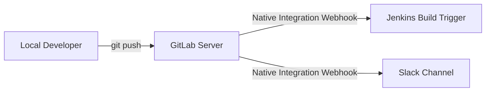

# GitLab Native Integrations: Jenkins Trigger & Slack Notification

This repository is configured to use native GitLab integrations to automatically trigger a remote Jenkins build and send status notifications to Slack whenever code is pushed. 

By utilizing GitLab's built-in centralized template `Workflows/Branch-Pipelines.gitlab-ci.yml` in [.gitlab-ci.yml](file:///c:/Users/smrut/OneDrive/Desktop/CI%20CD%20pipeline/.gitlab-ci.yml), we establish a standard CI/CD workflow without writing or maintaining any custom execution code locally.

---

## Architecture Overview



---

## Configuration

To set up this workflow, you must configure both integrations in the GitLab project settings interface. No code changes are required in the repository.

### 1. Jenkins Integration

Natively notifies Jenkins of pushes and updates, and displays build statuses on GitLab commits/merge requests.

1. Navigate to **Settings > Integrations** in your GitLab repository.
2. Select **Jenkins** from the integrations list.
3. Configure the following settings:
   * **Active**: Check the box to enable the integration.
   * **Trigger**: Check **Push** (and optionally **Merge request**).
   * **Jenkins server URL**: E.g., `https://jenkins.example.com`
   * **Project name**: The exact name of your Jenkins job (e.g., `my-project-build`).
   * **Username**: Your Jenkins username.
   * **Password/API token**: Your Jenkins API token or password.
4. Click **Test settings** to verify the connection, then click **Save changes**.

### 2. Slack Notifications Integration

Natively sends beautifully formatted rich cards to your Slack channel on push events.

1. Navigate to **Settings > Integrations** in your GitLab repository.
2. Select **Slack notifications** from the integrations list.
3. Configure the following settings:
   * **Active**: Check the box to enable notifications.
   * **Trigger**: Check **Push** (and optionally **Pipeline** or **Merge request**).
   * **Webhook**: Enter your incoming Slack Webhook URL (e.g., `https://hooks.slack.com/services/...`).
   * **Username**: Optional sender name (e.g., `GitLab CI`).
   * **Channel**: The target Slack channel (e.g., `#ci-cd-alerts`).
4. Click **Test settings** to verify the channel message, then click **Save changes**.

---

## Developer Usage

To trigger the pipeline, simply make changes to your repository and push them:

```bash
# Clone the repository
git clone <your-gitlab-repo-url>
cd <repo-name>

# Make changes, stage, and commit
git add .
git commit -m "feat: Add new features"

# Push to the remote repository
git push origin main
```

Since the integrations are configured at the GitLab project level, the triggers will execute automatically server-side upon push
