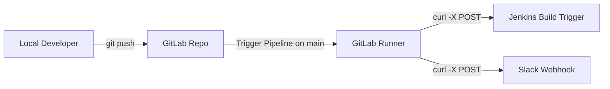

# GitLab CI/CD Pipeline: Jenkins Trigger & Slack Notification

This repository contains a lightweight, native GitLab CI/CD pipeline that automatically triggers a remote Jenkins build and sends a status notification to Slack whenever code is pushed to the `main` branch.

The execution of the pipeline happens entirely on remote **GitLab Runners** and does not require any local CLI tools or dependencies beyond standard Git.

---

## Architecture Overview



---

## Configuration

To make this pipeline function correctly, you must configure three secret repository-level variables in GitLab. Do not hardcode these values in the pipeline code.

### Required GitLab CI/CD Variables

1. Navigate to **Settings > CI/CD** in your GitLab repository sidebar.
2. Expand the **Variables** section.
3. Click **Add variable** and configure the following:

| Key | Value Description | Type | Masked |
| :--- | :--- | :--- | :---: |
| **`JENKINS_URL`** | The URL of your remote Jenkins job trigger (e.g., `https://jenkins.example.com/job/my-project-build/build`) | Variable | Yes |
| **`JENKINS_WEBHOOK_TOKEN`** | The authentication token configured in Jenkins for remote triggering | Variable | Yes |
| **`SLACK_WEBHOOK_URL`** | The incoming Slack webhook URL (e.g., `https://hooks.slack.com/services/YOUR_WORKSPACE_ID/YOUR_CHANNEL_ID/YOUR_TOKEN`) | Variable | Yes |

> [!IMPORTANT]
> Make sure to check **Mask variable** for all of the above to prevent your secrets and webhook URLs from appearing in build logs.

---

## Pipeline Workflow

The pipeline is defined in [.gitlab-ci.yml](file:///c:/Users/smrut/OneDrive/Desktop/CI%20CD%20pipeline/.gitlab-ci.yml) and consists of two sequential stages:

### 1. `trigger_jenkins`
* **Job**: `trigger_jenkins_job`
* **Action**: Runs a `curl -X POST` command targeting the configured `$JENKINS_URL` with the `$JENKINS_WEBHOOK_TOKEN` to start the build.
* **Runs on**: Only when code changes are pushed to the `main` branch.

### 2. `notify_slack`
* **Job**: `notify_slack_job`
* **Action**: Sends a JSON-formatted payload using `curl` to the `$SLACK_WEBHOOK_URL` informing the Slack channel about the new push.
* **Runs on**: Only when code changes are pushed to the `main` branch.

---

## Developer Usage

To trigger the pipeline, simply make changes to your repository and push them to the `main` branch:

```bash
# Clone the repository
git clone <your-gitlab-repo-url>
cd <repo-name>

# Make changes, stage, and commit
git add .
git commit -m "feat: Add new features"

# Push to the main branch to trigger the pipeline
git push origin main
```
